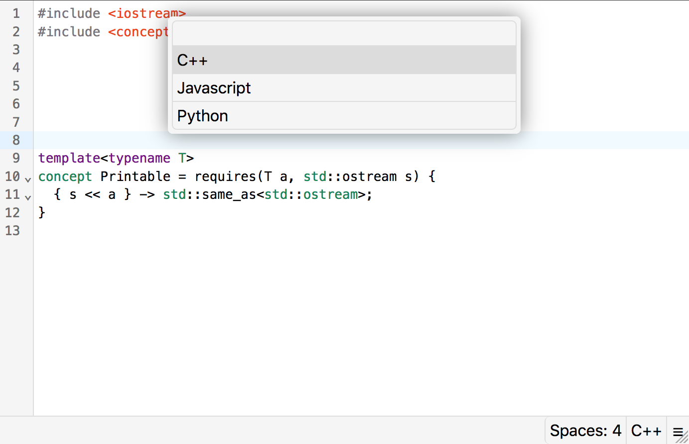

# moned

An editor based on [CodeMirror 6](https://codemirror.net/) made with vanilla [TypeScript](https://www.typescriptlang.org/)! :cake:



## running

Since the editor is very WIP right now, to run it you need to use rollup directly:
```
node_modules/.bin/rollup -c
```

You can also use the `-w` flag for rollup to watch for file changes

